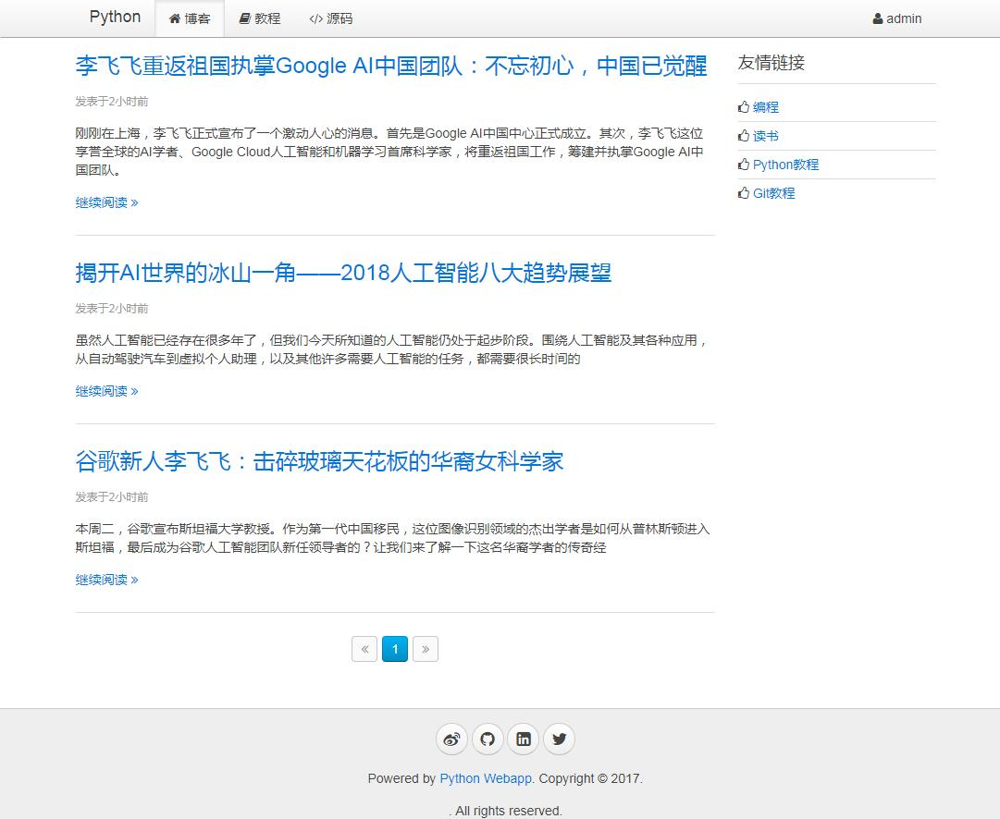

## python3 练手项目

此项目是[廖雪峰python3教程](https://www.liaoxuefeng.com/wiki/0014316089557264a6b348958f449949df42a6d3a2e542c000)的实战代码

### 准备工作
python环境及以下库：

1. python3.5版本  
2. aiohttp: 支持异步http服务器  
3. jinja2: python模板引擎
4. aiomysql: aiomysql针对asyncio框架用于访问mysql数据库  

所有的的库都可以通过pip工具安装

### 代码结构

	doc 
		- schema.sql: mysql数据库初始化脚本
	www
		- cn: python3教程其他工程代码
		- static: 存放静态资源文件
		- templates:存放模板文件
		- test: 测试文件
		- tmp: 临时文件
		- app.py: HTTP服务器以及处理HTTP请求；拦截器、jinja2模板、URL处理函数注册等
		- orm.py: ORM框架
		- coroweb.py: 封装aiohttp，即写个装饰器更好的从Request对象获取参数和返回Response对象
		- apis.py: 定义几个错误异常类和Page类用于分页
		- config_default.py:默认的配置文件信息
		- config_override.py:自定义的配置文件信息
		- config.py:默认和自定义配置文件合并
		- markdown2.py:支持markdown显示的插件
		- pymonnitor.py: 用于支持自动检测代码改动重启服务
		- test/testORM.py: 测试orm框架的正确性测试类

### 启动运行

启动app.py文件，访问[http://127.0.0.1:9000](http://127.0.0.1:9000)网址，可看到如下图的启动页面：

